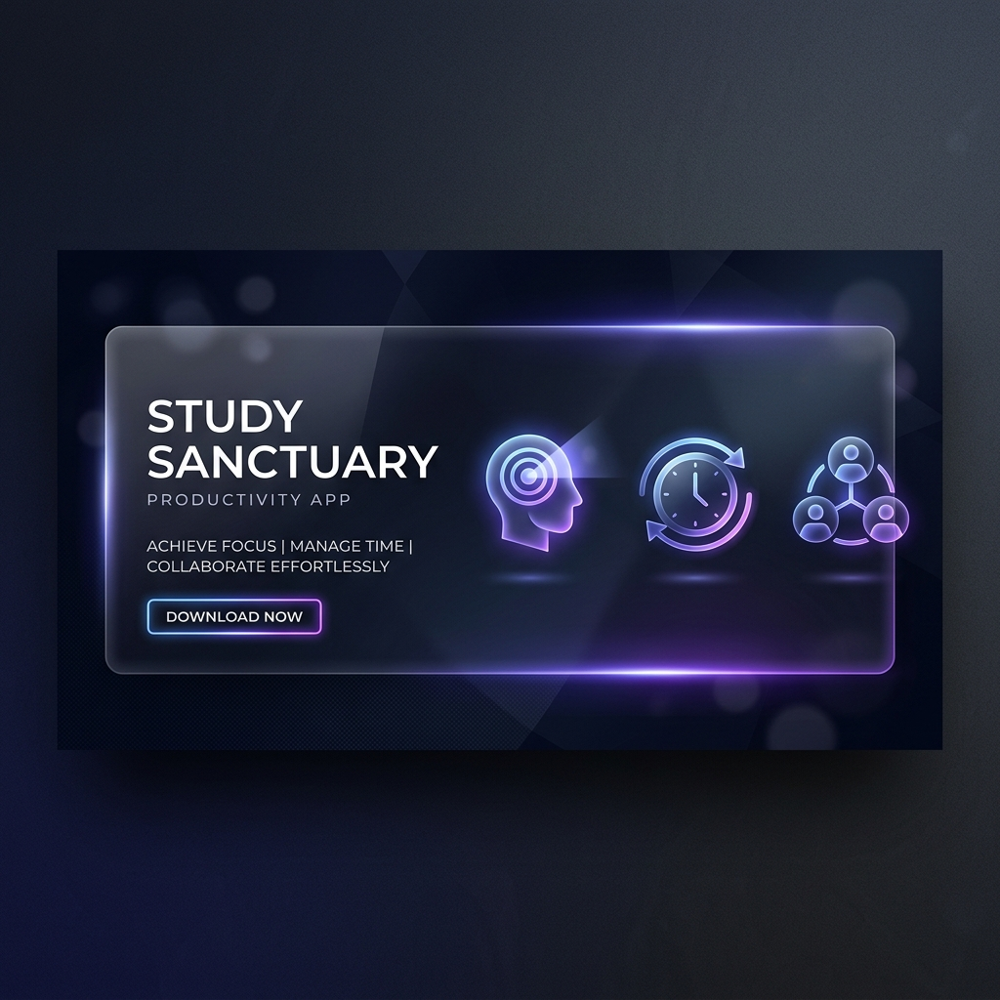

# 🌌 Study Sanctuary

[](https://choosealicense.com/licenses/mit/)
[](https://reactjs.org/)
[](https://vitejs.dev/)
[](https://capacitorjs.com/)
[](https://firebase.google.com/)



## 📖 Overview

**Study Sanctuary** (formerly Day-Planner) is a premium, cross-platform productivity and academic planning ecosystem. Built for modern students, researchers, and collaborative partners, it blends deep-focus tools with collaborative features to create a seamless "Sanctuary" for your academic life.

Whether you're tackling a complex syllabus alone or staying synchronized with a study partner, Study Sanctuary provides the architecture to turn goals into reality.

---

## ✨ Key Features

### ⏱️ Focus & Time Mastery
- **Advanced Pomodoro Engine:** A customizable timer with interval tracking to maintain peak cognitive flow.
- **Deep Focus Tracker:** Monitor your "in the zone" sessions with detailed analytics.
- **Native Android Alarms:** Precision notifications and system-level alarms powered by Capacitor.
- **Exam Countdown HUD:** Never lose sight of critical milestones with visual countdown timers.

### 📚 Academic Infrastructure
- **Syllabus & Assignment Tracker:** Granular management of your course content and pending deadlines.
- **Dynamic Timetable:** A flexible daily schedule manager tailored for school or university life.
- **Weekly Goal Architecture:** Set intentions and review progress with automated retrospective reports.
- **Monthly Planner:** High-level strategic planning for long-term academic success.

### 🤝 Collaborative "Couples" Mode
- **Shared Real-time Whiteboard:** Brainstorm, solve problems, or leave notes for your partner in a shared visual space.
- **Study Leaderboard:** Gamify your productivity with friendly competition and shared progress tracking.
- **Profile Synchronicity:** Easily switch between individual and shared study views.

### 🧠 Intelligence & Well-being
- **AI Study Catalyst:** Get tailored study tips and organizational advice generated by integrated AI.
- **Mood & Energy Log:** Correlation tracking between your well-being and academic performance.
- **Screen Time Analytics:** Monitor app usage to maintain a healthy digital-study balance.

---

## 🛠️ Tech Stack

- **Frontend:** `React 19` + `Vite` (Ultra-fast HMR and performance)
- **Native Bridge:** `Capacitor v8` (Seamless Android/iOS integration)
- **Database & Auth:** `Firebase v12` (Real-time sync, secure authentication, and hosting)
- **Logic & Tools:** `ESLint v9`, `React Router 7`, `Sharp` (Image processing)

---

## 🚀 Getting Started

### Prerequisites
- [Node.js](https://nodejs.org/) (Latest LTS recommended)
- [Android Studio](https://developer.android.com/studio) (For native builds)

### Installation

1. **Clone the repository:**
   ```bash
   git clone https://github.com/Mr-Ritesh-t/Day-Planner.git
   cd Day-Planner
   ```

2. **Install dependencies:**
   ```bash
   npm install
   ```

3. **Set up environment variables:**
   Create a `.env` file in the root directory and add your Firebase configurations.

4. **Run development server:**
   ```bash
   npm run dev
   ```

### Mobile Deployment (Android)

1. **Build web assets:**
   ```bash
   npm run build
   ```

2. **Sync with Capacitor:**
   ```bash
   npx cap sync android
   ```

3. **Launch in Android Studio:**
   ```bash
   npx cap open android
   ```

---

## 📂 Project Structure

```text
Study-Sanctuary/
├── android/              # Native Android project files
├── public/               # Static assets (images, icons)
├── src/
│   ├── assets/           # UI assets and styles
│   ├── components/       # Reusable UI modules (Timetable, FocusTracker, etc.)
│   ├── hooks/            # Custom React logic
│   ├── pages/            # View components (Planner, FocusHub, Analytics)
│   ├── firebase.js       # Database configuration
│   └── App.jsx           # Main application router and logic
├── vite.config.js        # Vite build configuration
└── package.json          # Project dependencies and scripts
```

---

## 🤝 Contributing

Contributions are what make the open-source community such an amazing place to learn, inspire, and create. Any contributions you make are **greatly appreciated**.

1. Fork the Project
2. Create your Feature Branch (`git checkout -b feature/AmazingFeature`)
3. Commit your Changes (`git commit -m 'Add some AmazingFeature'`)
4. Push to the Branch (`git push origin feature/AmazingFeature`)
5. Open a Pull Request

---

## 📄 License

Distributed under the MIT License. See `LICENSE` for more information.

---

<p align="center">
  Built with ❤️ for better learning.
</p>
